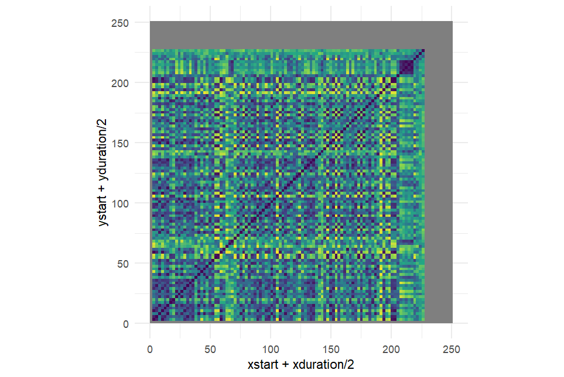
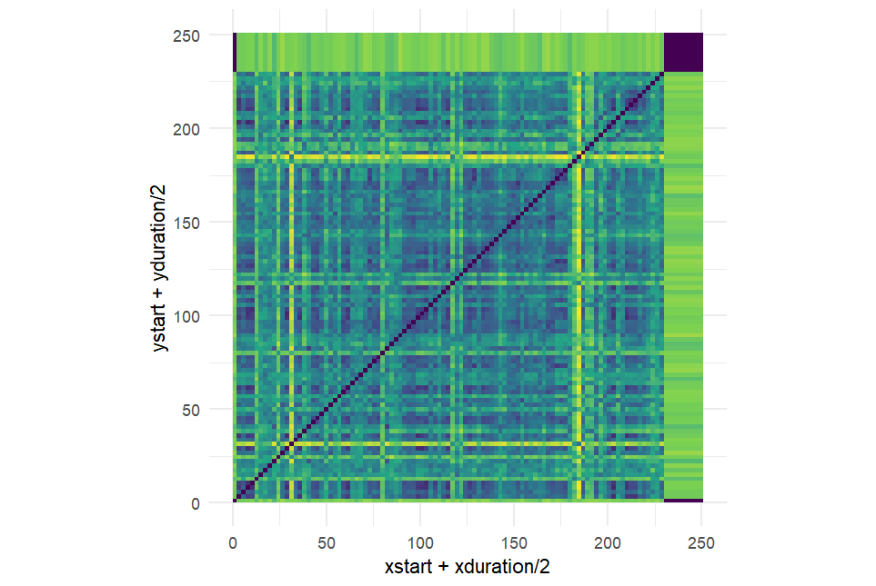
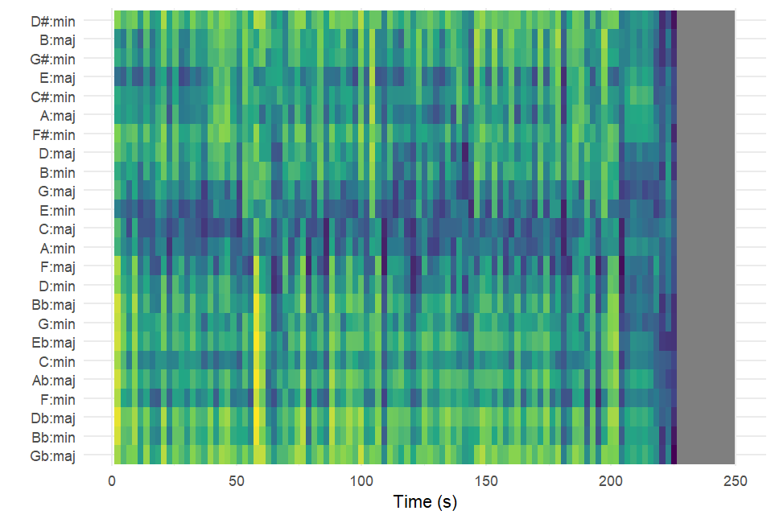
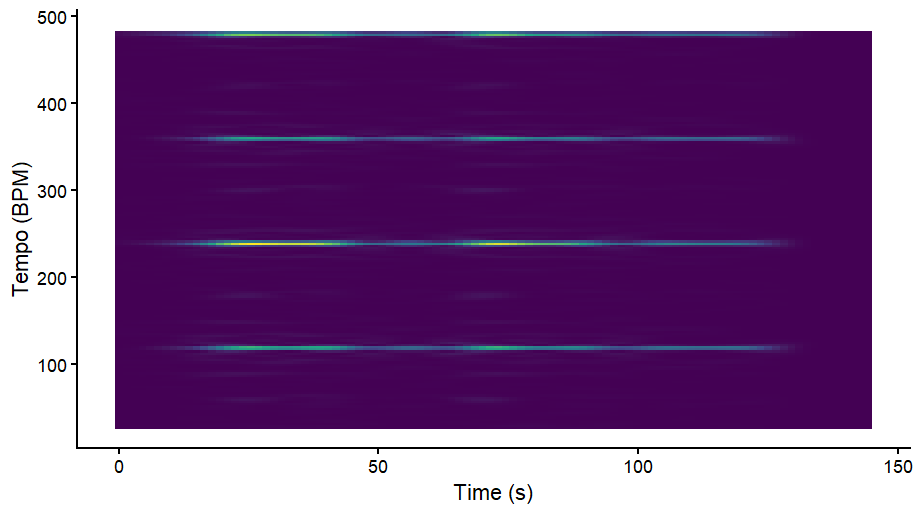

# Self Similarity - Pitch

Comparing the pitch-based self-similarity matrix, distinct block patterns correspond to the musical sections of the song: A1, A2, B, A1, B, A2, where A represents verses and B the chorus. Around 60 seconds, the first chorus begins, with higher pitch reflected as a yellow/green vertical line in the matrix. A similar pattern appears just before 150 seconds during the second chorus, marked by richer harmonies in the line “cause I, cause I, I don't know how to feel.” Towards the end, the instrumentation is sparser and primarily vocals, producing thicker green bands that reflect the overall pitch stability.

# Self Similarity - Timbre 

Examining the timbre-based self-similarity matrix, several connections between sound and visual representation are visible. Around 30–40 seconds, a yellow line corresponds to a peak in the song where additional instruments are heard during the lyrics “taking a drive.” Green lines around 80 seconds reflect sections with mostly humming vocals. Around 120 seconds, new instruments appear, indicated by corresponding lines in the matrix. Thick yellow lines near 180 seconds represent a unique instrument with a “twinkling” or shimmering quality, heard only in that section."

# Keygram 

The keygram computed using the Chebyshev distance shows that several keys consistently have lower distance values (darker blue regions), indicating a stronger similarity to the harmonic content of the piece. In particular, C major and A minor appear frequently as darker rows across much of the time axis, suggesting that the music is centered around the C major tonal region.Other closely related keys such as G major and E minor also show relatively low distance values. Since these keys are neighbours in the Circle of Fifths, their prominence likely reflects harmonic relationships.

Most of the song shows signs of tonal stability except around 50–60 seconds, a noticeable change in the colour pattern occurs where the darker regions briefly shift to different keys. This could indicate a short modulation.

Overall, the keygram suggests that the global tonal center is most likely C major (or its relative minor A minor), with occasional emphasis on closely related keys such as G major or E minor due to harmonic relationships within the tonal system.

# Tempogram
