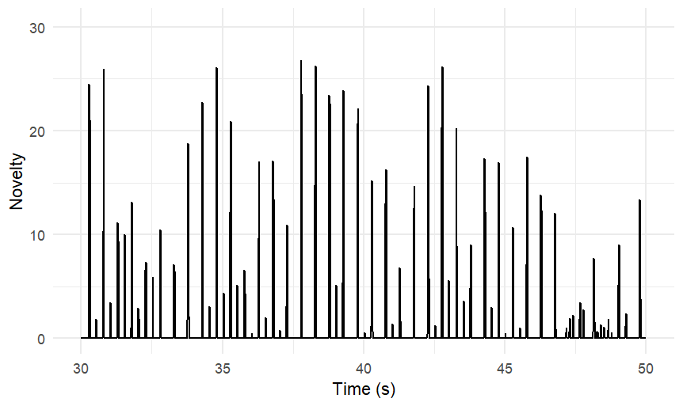
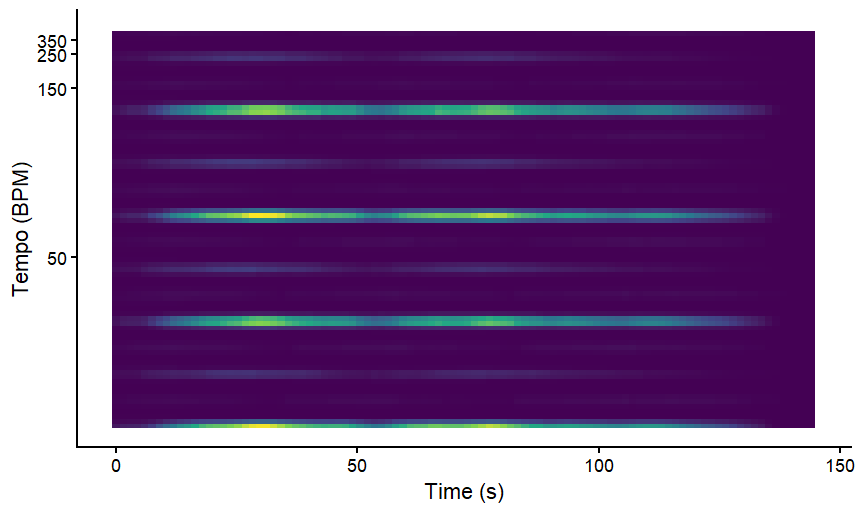
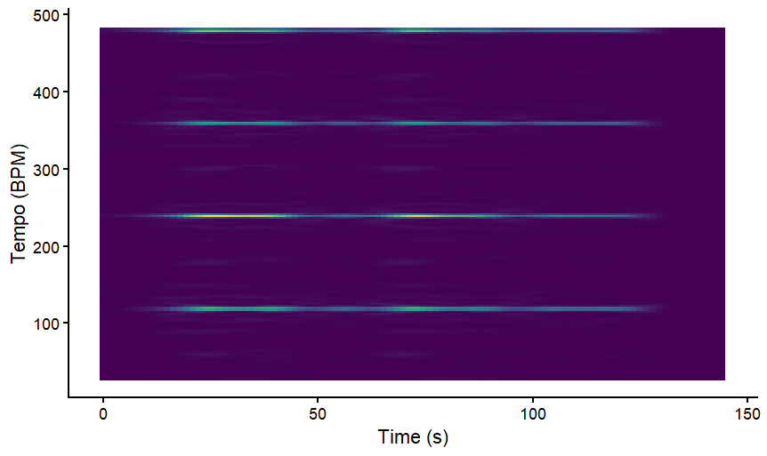
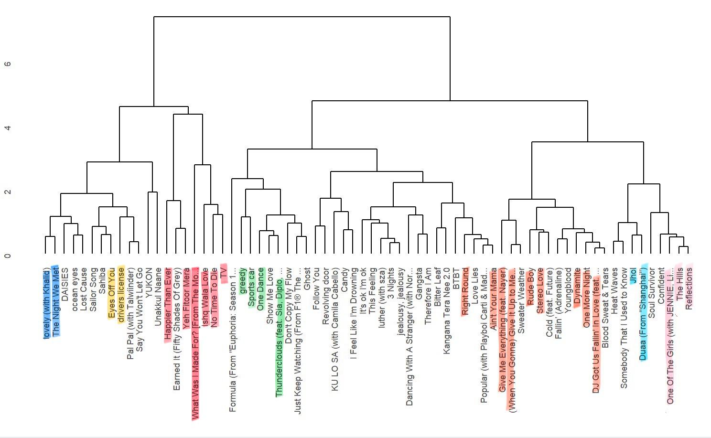
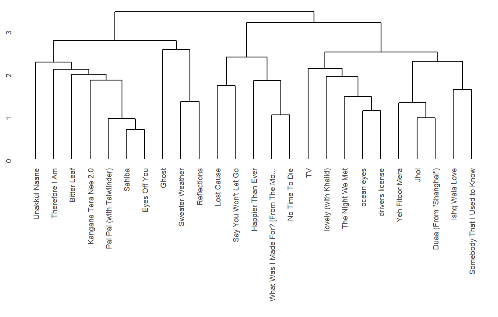

# Self Similarity

## Column {width="40%"}

 

## Column {width="60%"}

<h4>Self Similarity - Pitch</h4>

Comparing the pitch-based self-similarity matrix, distinct block patterns correspond to the musical sections of the song: A1, A2, B, A1, B, A2, where A represents verses and B the chorus. Around 60 seconds, the first chorus begins, with higher pitch reflected as a yellow/green vertical line in the matrix. A similar pattern appears just before 150 seconds during the second chorus, marked by richer harmonies in the line “cause I, cause I, I don't know how to feel.” Towards the end, the instrumentation is sparser and primarily vocals, producing thicker green bands that reflect the overall pitch stability.

<h4>Self Similarity - Timbre</h4>

Examining the timbre-based self-similarity matrix, several connections between sound and visual representation are visible. Around 30–40 seconds, a yellow line corresponds to a peak in the song where additional instruments are heard during the lyrics “taking a drive.” Green lines around 80 seconds reflect sections with mostly humming vocals. Around 120 seconds, new instruments appear, indicated by corresponding lines in the matrix. Thick yellow lines near 180 seconds represent a unique instrument with a “twinkling” or shimmering quality, heard only in that section."

# Keygram

## Column {width="40%"}

## Column {width="60%"}

The keygram computed using the Chebyshev distance shows that several keys consistently have lower distance values (darker blue regions), indicating a stronger similarity to the harmonic content of the piece. In particular, C major and A minor appear frequently as darker rows across much of the time axis, suggesting that the music is centered around the C major tonal region.Other closely related keys such as G major and E minor also show relatively low distance values. Since these keys are neighbours in the Circle of Fifths, their prominence likely reflects harmonic relationships.

Most of the song shows signs of tonal stability except around 50–60 seconds, a noticeable change in the colour pattern occurs where the darker regions briefly shift to different keys. This could indicate a short modulation.

Overall, the keygram suggests that the global tonal center is most likely C major (or its relative minor A minor), with occasional emphasis on closely related keys such as G major or E minor due to harmonic relationships within the tonal system.

# Tempogram

## Column {width="40%"}

tempogram   

## Column {width="60%"}

<h4>Novelty Histogram</h4>

Murder in my Mind by Kordhell is a very energetic song that is shown by the novelty histogram. The presence of multiple spikes at fairly regular distance is consistent with the sonmg that has rhythmic onsets and consistent beats and percussive elements.

<h4>ACF and DFT Tempograms</h4>

The ACF Tempogram shows clear bands around 30-35 BPM, 60-70 BPM, and 120-140BPM indicating clear tempo subharmonics. It is likely that 120 BPM is the beat level tempo of this song. The DFT tempogram on the other hand shows clear bands at 120, 240 and 360 indicating the strong harmonic frequencies.

# Clustering

## Column {width=50%}
<h4>Corpus Details </h4>
Some background information about my corpus since the other pages may not be fully related : My corpus consists of top 70 songs that I have been actively listening to and consistently keep going back to. In my opinion, I have 2 major kinds of music I lean towards - 1. High energy, very danceable pop music (for when I am feeling great :) ) 2. Low energy, slow paced songs (when I am down in the dumps as one sometimes is). My main idea is to explore if there are any commonalities at a deeper level in terms of keys, tempo or chords that I was previously not aware of. Hence, my final corpus of 70 consists of 45 songs that I consider 'high' and 25 that I consider 'low'.

<h4>Hierarchial Clustering </h4>
The hirarchial cluster rendered uninteresting results when all the elements of the "recipe" were used. I then picked the top 3 features that were the most useful in classifying music according to the Random Forest Algorithm to see how different the results would be. To my surprise a combination of Loudness, Energy and Acousticness worked out quite well on my whole corpus. It divided it into a 25-75% split of low-dominant and high-dominant song. This is pretty impressive as my original split of portfolio is at 35-65%. I have highlighted areas in similar colours where I agree the songs in proximity are pretty similar. It has accurately identified common music types like slow, acoustic songs (in red), danceable club hits of Pitbull, Usher etc (in peach), upbeat but still a very different vibe of songs in pink like those by the Weeknd and The Neighbourhood. 

The results of the clustering on just the 25 low songs were more interesting. It essentially divided into 2 sub-clusters of songs that are low yet still upbeat like Therefore I am, Bitter Leaf, Pal Pal and the bigger cluster consists of more acoustic, 'sadder' sounding songs. It seems to have accurately clustered most of Billie Eilish's songs in the middle from Lost Cause to Lovely.

## Column {width=50%}

